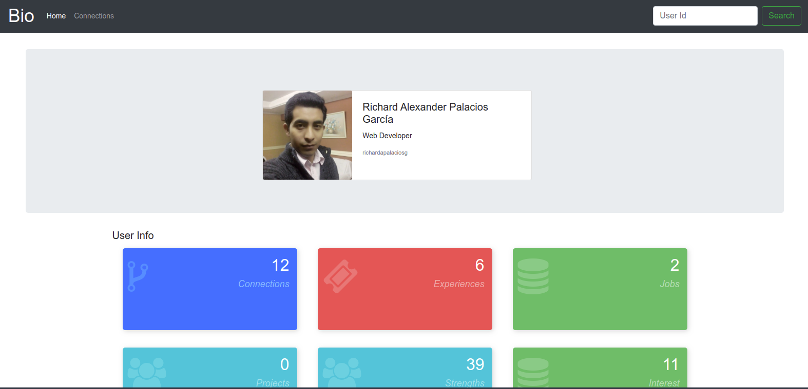

# Display Bio Torre
Este proyecto es creado como parte de prueba técnica en Torre. El cual muestra una pequeña consola tipo dashboard con información de la bio de un Usuario en torre.co



A travez de los siguientes endpoints del API de torre.co debo mostrar y jugar con la información a mano.
- GET https://torre.bio/api/bios/$username (gets bio information of $username)
- GET https://torre.bio/api/people/$username/connections?[q=$query&limit=$limit] (lists people sorted by connection degrees relative to $username)
- GET https://torre.bio/api/people?[q=$query&limit=$limit] (search for people in general)


## Technology:
- Node.js (JavaScript ES6)
- Express.js
- NPM
- AXIOS
- GIT
- HTML,CSS (Bootstrap)

## Empezar
Clonamos este repositorio con tu cliente de git.

### Instalación de dependencias
Un paso importante antes de arrancar el servidor es instalar todas las dependencias del proyecto. Para hacerlo, en un terminal ejecutamos lo siguiente:
```shell
> npm install
```

### Iniciar App
Hay varias formas de iniciar o arrancar esta app:
- En modo DEBUG para el desarrollo, ejecutamos en un terminal donde veremos todo el verbo y mensajes del servidor en consola:
```shell
> npm run dev
```
- En modo Produción, ejecutamos (aqui no veremos mensajes en consola):
```shell
> npm run prod
```
> Se puede conocer mas de estos comandos revisando el apartado `scripts` en el archivo de configuración *package.json*

Después de iniciar la app ingresamos al url [http://localhost:3000/](http://localhost:3000/).

